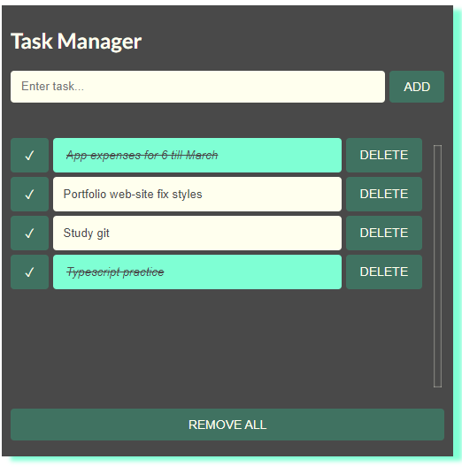

# Todo List

Create a todo list using only html, css and javascript. The focus is on js code, however also design is done with SCSS for the first time in my projects

## Requirements

By default, the list is empty. There's a input that when user type in and click submit button, a new item will appended to the current list, showing in the screen. And each item can be removed by a button

## Screenshot

